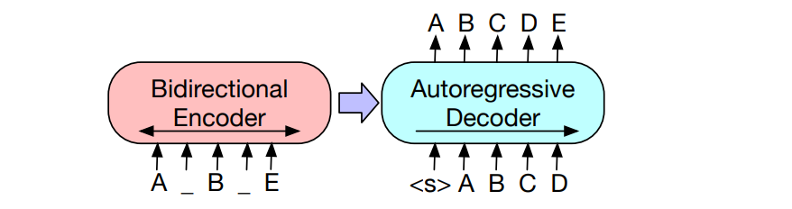
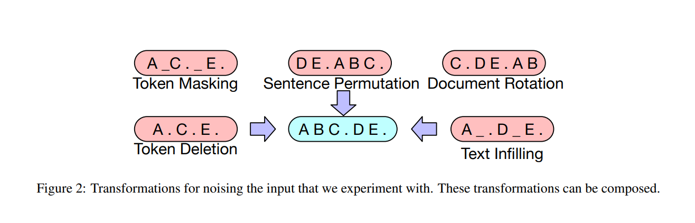
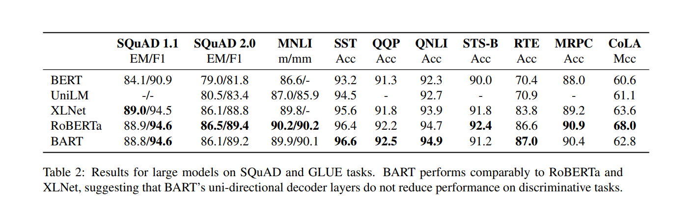
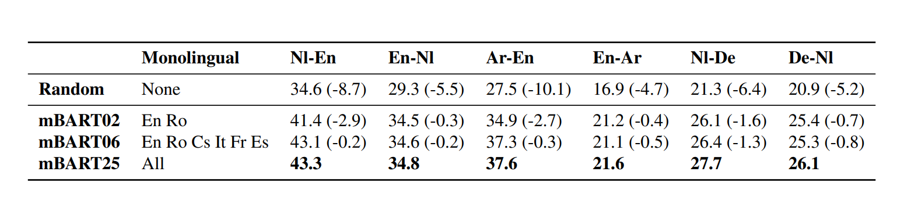

BART Paper - [BART: Denoising Sequence-to-Sequence Pre-training for Natural
Language Generation, Translation, and Comprehension](https://arxiv.org/pdf/1910.13461.pdf)

In a Single line it is a **seq2seq Tranformer** (thus much more generalised form of BERT and GPT) and is trained in a **Denoising Autoencoder Manner** (similar to BERT's Masked Language model). 
{: .mx-auto.d-block :}

Through this work it can be seen that the pre-train finetune method which has become so popular since BERT, is also applicable for seq2seq tasks like Machine Translation, Question Answering (Generative) while not loosing out on comprehension tasks like Extractive QA.

Existing Tranformers are mostly trained on Mask Language Modelling which are also auto encoders of sort that are trained to reconstruct text with a random subset of words masked out. They work on a particular type of end task (like Span Prediction, Generation etc.). 
BART is model which is a denoising autoencoder built with a seq2seq model. 
This makes it applicable to a much wider variety of tasks.
Can be seen as a seq2seq model with **BERT like encoder** and **GPT like decoder** ('like' is important as it is similar but not same, so you cant just plug both of them together and call it BART).

**Why can't we use BERT for these tasks?**

BERT is a bidirectional encoder- Meaning it takes in a sentence (with a Masked out tokens), sees the word around it and predicts the word which should replace them. The issue is it cant generate new words as it is not working in an Autoregressive Manner (like RNNs for example).
It can be made to work in a LM fashion by ensuring mask is at end and repeatedly sending the sentence into BERT after each prediction check out UniLM. But since here in each case it doesnt get context from the right side of mask the performance will deteriorate and inference time will be very high.

**So then why not GPT?**

GPT - Works in an autoregressive way. Hence it can be used for LM but doesnt take into account the input sentence very well (no Bidirectionality).
Bidirectional Nature of BERT is special because there is interactions between left and right context words. Prev methods like BiRNN and ELMo used to concatenate left only and right only representations hence no interactions was present between these features.


**Architecture of BART**

6 layers in both encoder and decoder.
Major changes from BERT - Each layer of Decoder performs cross attention wwith Final hidden Layer of encoder (similar to seq2seq). The feedforward layers are removed from Encoder side, which just increases the number of params in BART by 10% despite having an arch roughly twice the size.

**Corruptions used in BART** - 
The masking or corruptions in the input data are very interesting, I feel that simple seq2seq models should also be trained in some manner on these.
{: .mx-auto.d-block :}

I have included a code to do the Masking corruption here

```python
def mask_tokens(input, vocab_len, mask_token = 0.0, mask_prob = 0.7):
    """
    Converts 70% of Input to MASK 15% random other tokens 15% original
    """
    
    labels = input.clone()
    probability_matrix = torch.full(labels.shape, mask_prob)
    
    #This line prevents any special tokens like <START> from getting converted into a Mask.
    #If you dont have any such you can comment it out and if you do, you can pass a mask(boolean) as the arguement to the func.
    probability_matrix.masked_fill_(torch.tensor([1]+[0]*(len(input)-2)+[1]).bool(), value=0.0)

    #Indices of the Masks
    masked_indices = torch.bernoulli(probability_matrix).bool()
    labels[~masked_indices] = -100  ##Loss is only computed on masked Tokens
    
    
    indices_replaced = torch.bernoulli(torch.full(labels.shape, mask_prob)).bool() & masked_indices
    input[indices_replaced] = mask_token

    #Replacing the half of the non masked ones with random tokens
    indices_random = torch.bernoulli(torch.full(labels.shape, 0.5)).bool() & masked_indices & ~indices_replaced
    random_words = torch.randint(len(vocab), labels.shape, dtype=torch.float)
    input[indices_random] = random_words[indices_random]

    return input, labels
```
***
Sample Input and Outputs

| Original Sent | Updated Sent  |
|------|-------|
| At that moment he wasn't listening to music, he was living an experience. | At [MASK] [MASK] [MASK] wasn't [MASK] [MASK] music, [MASK] was living [MASK] experience. |
| It was difficult for Mary to admit that most of her workout consisted of exercising poor judgment.| It [MASK] difficult for Mary to admit At most [MASK] [MASK] workout [MASK] [MASK] exercising of judgment. |
| Nobody has encountered an explosive daisy and lived to tell the tale.| the has encountered an explosive daisy difficult [MASK] to tell the [MASK] |


## Tasks on which BART can be finetuned-

1. **Sequence Classifiation Tasks** - Like Paragraph level Sentiment analysis. In BART there is also a [CLS] token appended to the **end**. We can use a Fully connected layer to classify corresponding to the output of this end [CLS] token. Its appended at the end so that it can get attention scores from all prev words (Decoder moves in a left to right manner unlike BERT).

2. **Token Classification Tasks** - Like SQuAD QA. Entire Top Hidden state of Decoder for Classification

3. **Generative Tasks** - Generative QA and Summarisation etc. Possible since decoder works in Autoregressive manner.

4. **Machine Translation** - Either you can train the entire arch from scratch or use pretrained BART as a pretrained Decoder. This can be done by replacing the embedding layer in BART therefore learning a mapping from the new language to a shared space which BART's decoder understands. Also see **mBART** explained below 

{: .mx-auto.d-block :}

+ On sequence comprehension Tasks like SQuAD turns out the best BART model (trained using Text Infilling) beats the BERT base model (F1 Scores 90.8 vs 88.5) which means the ability to work on Generative tasks didnt come at a cost of drop in comprehension accuracy.

+ Pre training tasks matter a lot in determining accuracy of models. Some form of Token Masking is necessary, models which are trained only on tasks like Permuting Sentences perform poorly.


Glue - The General Language Understanding Evaluation (GLUE) benchmark is a collection of nine different language understanding tasks.
Squad - 
1. v1.1 is a collection of 100,000 crowdsourced question/answer pairs drawn from Wikipedia.
2. v2.0, introduced in 2018, and builds on this with 50,000 unanswerable questions designed to look like answerable ones. To perform well, the NLP model must determine when the correct answer is not available.


## mBART
Paper - [Multilingual Denoising Pre-training for Neural Machine Translation](https://arxiv.org/abs/2001.08210)

Its a **seq2seq denoising autoencoder** pre-trained on **large scale monolingual corpora in many languages**.
In short it is BART applied to a large scale monolingual corpora of many different languages. Input is noised and it learns to reconstruct itself.
Given that it has 680M parameters the task of **Learning Semantics of Language** and **Generating coherent sentences** that too in **25+ languages** is a very impressive feat.

This acts as a **initialisation** for NMT tasks, the model downloaded from their website won't work very well right out of the box. Now using this pretrained mBART you can train on the paired data between the languages you want to translate, but thats not it, you can also work with languages lacking a paired set.

So this would mean that it **may have learnt** some semantics of the language it saw during pretraining?
But this is not the case-
It improves performance on Languages not included in the Pre-training set also. This suggests that the pre-training steps actually make the Transformer learn some **language universal aspects**.

{: .mx-auto.d-block :}


**Unsupervised Methods for MT**
So for best results there needs to exist a parallel corpus of Source Text - Target Text, but if that is not possible there are some workarounds the authors mention
1. When no Paired text exists. In that case **backtranslation** can be used, the process is best understood by this image.

2. Parallel corpora exists for both, but not with each other. Zero Shot Transfer also works.

